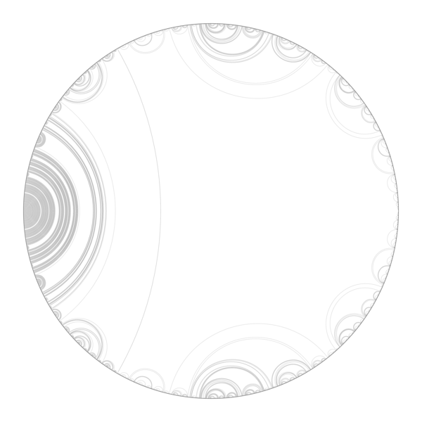

This is clone of the [original repsitory](https://bitbucket.org/clintonc/drawlam/src/default/) by Clinton Curry 


# DrawLam.py

DrawLam.py is a Python library which makes it easy to draw laminations, including pullback laminations.  It is capable of producing PNG and PDF output.

## Prerequisites

This library calls upon [PyCairo][1] and [gmpy][2] for its dark deeds.


In ubuntu:

```bash
pip2 install gmpy --user
```

## Usage

DrawLam.py is designed to be used in Python scripts.  There are several sample scripts available in the "examples" directory in the source tree.  The simplest possible script for drawing the lamination
corresponding to the rabbit is given below; 

lami3.py
* it takes ten iterative preimages of the (1/7, 2/7) leaf which do not cross the (1/7, 9/14) chord.  
* The "True" associated with that leaf indicates that preimages are to be taken in the [1/7, 9/14) interval and the [9/14, 1/7) interval; "False" would give the opposite endpoint arrangement.


```python
from DrawLam import DrawLam
from gmpy import mpq

L = DrawLam()
L.degree = 2
L.pullbackscheme = [(mpq(1,7), mpq(9,14), True)]
L.filename = "lami3.png"
L.start()
L.iterative_preimages((mpq(1,7), mpq(2,7)), 10)
L.writeout()
```
    
    
The resulta is lami3.png

      


    
### examples    
Original examples

Run from console 

```bash
cd examples 
python lami1.py
```
    
      

  

  


  

  

  

and [pdf file](examples/qml.pdf)


### regular examples

Description and examples not by original author but by Adam Majewski ( only small modifications of some of the original examples)

[Quadratic invariant laminations](https://arxiv.org/abs/1707.05384) of unit disk and:
* coresponding Julia sets for complex quadratic polynomial ( to show the landing pattern of external rays and structure of Julia set )
* dynamics of angle doubling map


These images show laminations associated with period n components on the boundary of main cardioid.
 


To create images run from console: 

```bash
cd regular_examples 
python lami2.py
```


  

  


  

  

  

  

  

  


Algorithm
* start with period p 
* compute denominator d: $`d = 2^p -1`$
* 


### period 2
$` L_{1/3}`$ : Lamination of unit circle which correspond to lamination of the dynamic plane for Basilica Julia set.

 

External rays 1/3 and 2/3 
* on the parameter plane = angles of the wake 1/2
* on the dynamic plane land on the fixed point


  

Basilica lamination
  

The Basilica Julia set has only one kind of pinch point ( cut points): biaccesible.


Image with major ( red dashed line) and minor leaf ( solid blac line ) marked  

  
  
It can be created with :
* [lami_2_.py](regular_examples/lami_2_.py) from regular_examples subdirectory


Code:

```python
# lami_2.py
# python lami_2.py > lami2.txt
# As simply as possible, draw the lamination for period p

import sys
sys.path.append("..")
import DrawLam
from gmpy import mpq, version , gmp_version


# info 
print "Python version" 
print (sys.version) #parentheses necessary in python 3.  
ver = version()
print " gmpy version " 
print ver


gmp_ver = gmp_version() 
print "gmp version "
print gmp_ver


p = 2
print "period p = %d"% p
d = (2**p)-1
print "denominator d = %d"% d
depth = 10


L = DrawLam.DrawLam()
L.degree = 2
a1 = mpq(1,d)
a2 = mpq(1,d)+mpq(1,2)

MinorLeaf = (a1, mpq(2,d))
print "Minor Leaf :"
print MinorLeaf

MajorLeaf = (a1, a2) 
print "Major Leaf: "
print(MajorLeaf)


L.pullbackscheme = [(a1, a2, True)]
L.filename = "lami_"+str(p)+".png"


L.start()
print "draw preimages of minor leaf for depth %d"% depth
L.iterative_preimages(MinorLeaf, depth)
L.writeout()
```

text output:

```bash
Python version
2.7.15rc1 (default, Apr 15 2018, 21:51:34) 
[GCC 7.3.0]
 gmpy version 
1.17
gmp version 
6.1.1
period p = 2
denominator d = 3
Minor Leaf :
(mpq(1,3), mpq(2,3))
Major Leaf: 
(mpq(1,3), mpq(5,6))
Lamination data seems valid.
filetype:  png
draw preimages of minor leaf for depth 10
Writing file lami_2.png
```

See also :
* [lami2.txt](./regular_examples/lami2.txt) - new text output with all angles 


Description by Will Smith in [Thompson-Like Groups for Dendrite Julia Sets](http://faculty.bard.edu/belk/projects/WillSmith.pdf): 
>>>
We see that the pinch points for the Basilica are points that have external rays at angles   
that are rational numbers of the form $`\frac{3k - 1}{3·2^n}`$ and $`\frac{3k + 1}{3·2^n }`$ for some $`k, n ∈ N`$.   
    
In particular, the pinch point between the central interior region and the large region to the left of the central region has external rays at 1/3 and 2/3, and the pinch point between
the central region and the large region to the right of the central region has external rays at 5/6 and 1/6. Also observe the intuitive reason that pinch points are so named; 
the removal of a pinch point will separate the Julia set into two or more pieces.
>>>

### Period 3 


$` L_{1/7}`$ : Lamination of unit circle which correspond to lamination of the dynamic plane for Rabbit Julia set   

External rays 1/7 and 2/7 
* on the parameter plane = angles of the wake 1/3
* on the dynamic plane land on the fixed point 

The Rabbit Julia set has only one kind of pinch point ( cut points): biaccesible.


Usual image : 

  

It can be created with :
* [lami3.py](examples/lami3.py) from examples subdirectory
* [lami3.py](regular_examples/lami3.py) from regular_examples subdirectory
* [lami_3.py](regular_examples/lami_3.py) from regular_examples subdirectory

Image with major ( red dashed line) and minor leaf ( solid blac line ) marked  

  
  
It can be created with :
* [lami2.py](examples/lami2.py) from examples subdirectory


Image with shaded gaps: 


It can be created with :
* [lami5.py](examples/lami5.py) from examples subdirectory

Here gap is a space between 3 connected which form curvilinear triangle. This gap correspond to the tri-accesible point ( cut point of order 3)  on the dynamical plane


code from [regular_examples/lami_3.py](regular_examples/lami_3.py) which draws [regular_examples/lami_3.png](regular_examples/lami_3.png) image 
```python
# lami_3.py
# python lami_3.py
# As simply as possible, draw the lamination for period p

import sys
sys.path.append("..")
import DrawLam
from gmpy import mpq, version , gmp_version


# info 
print "Python version" 
print (sys.version) #parentheses necessary in python 3.  
ver = version()
print " gmpy version " 
print ver


gmp_ver = gmp_version()
print "gmp version "
print gmp_ver


p = 3
print "period p = %d"% p
d = (2**p)-1
print "denominator d = %d"% d
depth = 10


L = DrawLam.DrawLam()
L.degree = 2
a1 = mpq(1,d)
a2 = mpq(1,d)+mpq(1,2)

MinorLeaf = (a1, mpq(2,d))
print "Minor Leaf :"
print MinorLeaf

MajorLeaf = (a1, a2) 
print "Major Leaf: "
print(MajorLeaf)


L.pullbackscheme = [(a1, a2, True)]
L.filename = "lami_"+str(p)+".png"


L.start()
print "draw preimages of minor leaf for depth %d"% depth
L.iterative_preimages(MinorLeaf, depth)
L.writeout()


```


run : 

```bash
python lami_3.py
```

text output:

```bash
Python version
2.7.15rc1 (default, Nov 12 2018, 14:31:15) 
[GCC 7.3.0]
 gmpy version 
1.17
gmp version 
6.1.1
period p = 3
denominator d = 7
Minor Leaf :
(mpq(1,7), mpq(2,7))
Major Leaf: 
(mpq(1,7), mpq(9,14))
Lamination data seems valid.
filetype:  png
draw preimages of minor leaf for depth 10
Writing file lami_3.png
```


# License

Copyright (c) 2012, Clinton Curry
All rights reserved.

Redistribution and use in source and binary forms, with or without
modification, are permitted provided that the following conditions are
met:

* Redistributions of source code must retain the above copyright
  notice, this list of conditions and the following disclaimer.

* Redistributions in binary form must reproduce the above copyright
  notice, this list of conditions and the following disclaimer in the
  documentation and/or other materials provided with the distribution.

THIS SOFTWARE IS PROVIDED BY THE COPYRIGHT HOLDERS AND CONTRIBUTORS
"AS IS" AND ANY EXPRESS OR IMPLIED WARRANTIES, INCLUDING, BUT NOT
LIMITED TO, THE IMPLIED WARRANTIES OF MERCHANTABILITY AND FITNESS FOR
A PARTICULAR PURPOSE ARE DISCLAIMED. IN NO EVENT SHALL THE COPYRIGHT
HOLDER OR CONTRIBUTORS BE LIABLE FOR ANY DIRECT, INDIRECT, INCIDENTAL,
SPECIAL, EXEMPLARY, OR CONSEQUENTIAL DAMAGES (INCLUDING, BUT NOT
LIMITED TO, PROCUREMENT OF SUBSTITUTE GOODS OR SERVICES; LOSS OF USE,
DATA, OR PROFITS; OR BUSINESS INTERRUPTION) HOWEVER CAUSED AND ON ANY
THEORY OF LIABILITY, WHETHER IN CONTRACT, STRICT LIABILITY, OR TORT
(INCLUDING NEGLIGENCE OR OTHERWISE) ARISING IN ANY WAY OUT OF THE USE
OF THIS SOFTWARE, EVEN IF ADVISED OF THE POSSIBILITY OF SUCH DAMAGE.

[1]: http://cairographics.org/pycairo/
[2]: http://code.google.com/p/gmpy/


# Acknowledgments

* Hat tip to anyone who's code was used
* Inspiration
* etc


# technical notes
GitLab uses:
* the Redcarpet Ruby library for [Markdown processing](https://gitlab.com/gitlab-org/gitlab-ce/blob/master/doc/user/markdown.md)
* KaTeX to render [math written with the LaTeX syntax](https://gitlab.com/gitlab-org/gitlab-ce/blob/master/doc/user/markdown.md), but [only subset](https://khan.github.io/KaTeX/function-support.html)


## Git
```
cd existing_folder
git init
git remote add origin git@gitlab.com:adammajewski/drawlam.git
git add .
git commit -m "Initial commit"
git push -u origin master

```

local repo: :~/python/clintonc-drawlam 


