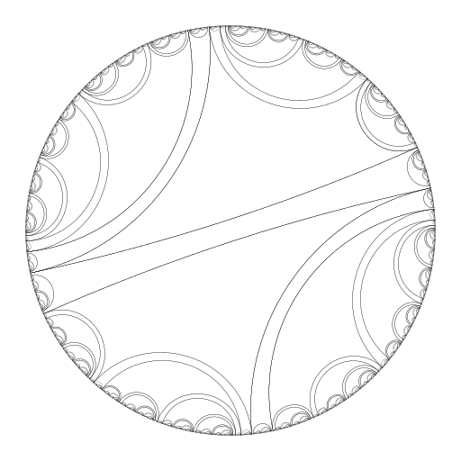

# DrawLam.py

DrawLam.py is a Python library which makes it easy to draw
laminations, including pullback laminations.  It is capable of
producing PNG and PDF output.

## Prerequisites

This library calls upon [PyCairo][1] and [gmpy][2] for its dark deeds.


In ubuntu:

```bash
pip2 install gmpy --user
```

## Usage

DrawLam.py is designed to be used in Python scripts.  There are
several sample scripts available in the "examples" directory in the
source tree.  The simplest possible script for drawing the lamination
corresponding to the rabbit is given below; it takes ten iterative
preimages of the (1/7, 2/7) leaf which do not cross the (1/7, 9/14)
chord.  (The "True" associated with that leaf indicates that preimages
are to be taken in the [1/7, 9/14) interval and the [9/14, 1/7)
interval; "False" would give the opposite endpoint arrangement.)

    :::python
    from DrawLam import DrawLam
    from gmpy import mpq

    L = DrawLam()
    L.degree = 2
    L.pullbackscheme = [(mpq(1,7), mpq(9,14), True)]
    L.filename = "lami2.png"
    L.start()
    L.iterative_preimages((mpq(1,7), mpq(2,7)), 10)
    L.writeout()
    
### examples    

Run from console 

```bash
cd examples 
python lami1.py
```
    
      

  

  


  

  

  

and [pdf file](examples/qml.pdf)


### regular examples

Run from console 

```bash
cd regular_examples 
python lami2.py
```


  

  


  

  

  

  

  

  

## License

Copyright (c) 2012, Clinton Curry
All rights reserved.

Redistribution and use in source and binary forms, with or without
modification, are permitted provided that the following conditions are
met:

* Redistributions of source code must retain the above copyright
  notice, this list of conditions and the following disclaimer.

* Redistributions in binary form must reproduce the above copyright
  notice, this list of conditions and the following disclaimer in the
  documentation and/or other materials provided with the distribution.

THIS SOFTWARE IS PROVIDED BY THE COPYRIGHT HOLDERS AND CONTRIBUTORS
"AS IS" AND ANY EXPRESS OR IMPLIED WARRANTIES, INCLUDING, BUT NOT
LIMITED TO, THE IMPLIED WARRANTIES OF MERCHANTABILITY AND FITNESS FOR
A PARTICULAR PURPOSE ARE DISCLAIMED. IN NO EVENT SHALL THE COPYRIGHT
HOLDER OR CONTRIBUTORS BE LIABLE FOR ANY DIRECT, INDIRECT, INCIDENTAL,
SPECIAL, EXEMPLARY, OR CONSEQUENTIAL DAMAGES (INCLUDING, BUT NOT
LIMITED TO, PROCUREMENT OF SUBSTITUTE GOODS OR SERVICES; LOSS OF USE,
DATA, OR PROFITS; OR BUSINESS INTERRUPTION) HOWEVER CAUSED AND ON ANY
THEORY OF LIABILITY, WHETHER IN CONTRACT, STRICT LIABILITY, OR TORT
(INCLUDING NEGLIGENCE OR OTHERWISE) ARISING IN ANY WAY OUT OF THE USE
OF THIS SOFTWARE, EVEN IF ADVISED OF THE POSSIBILITY OF SUCH DAMAGE.

[1]: http://cairographics.org/pycairo/
[2]: http://code.google.com/p/gmpy/
